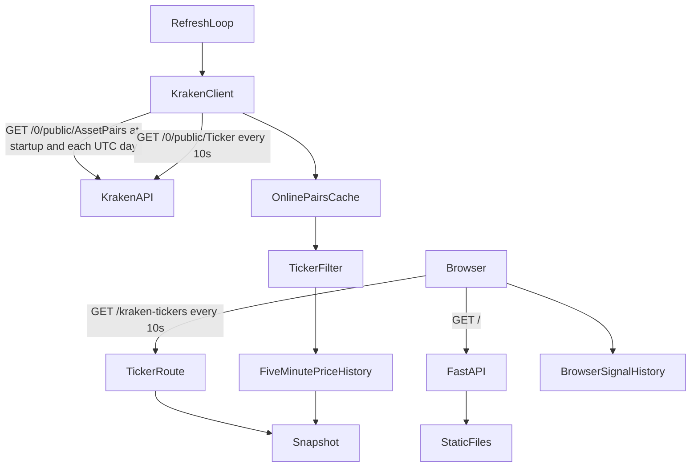

# Architecture

Kraken Spot Radar is a single-process FastAPI application with a static browser
dashboard. It reads public Kraken spot ticker data through `connector-kraken`;
it does not use private credentials or a database.

## Data flow



At startup, the FastAPI lifespan creates one `httpx.AsyncClient` and starts a
  background refresh loop. The app fetches USD pairs with `status == "online"`
  from `AssetPairs` at startup and again when the UTC date changes, then caches
  that list in memory. Every ten seconds, it fetches USD spot tickers and keeps
  only pairs in the online-pair cache before replacing the ticker snapshot. Pair
  names are normalized so the ticker form `XBT/USD` matches the `AssetPairs`
  alternate name `XBTUSD`. If fetching `AssetPairs` fails, the previous ticker
  snapshot remains intact and the app retries on its next refresh. Each accepted
  ticker sample is also kept in a per-pair in-memory history. `delta5m` compares
  the latest price with the most recent sample at or before the five-minute
  cutoff, provided the sample is no more than two refresh intervals (20
  seconds) older than the cutoff; if no sample meets that freshness limit,
  `delta5m` is `null` until a valid baseline becomes available. Once a value is
  calculated it stays frozen for five minutes and is then recalculated against
  the new cutoff, so `delta5m` updates once every five minutes while current
  prices and 24h open-close metrics continue refreshing every ten seconds. The
  history resets when the process restarts. This reuses the existing refresh
  loop and does not add another polling request. The dashboard polls the local
  ticker route at the same ten-second interval. When no snapshot has been loaded
  yet, that route attempts an immediate refresh.

The browser checks the top ten 24-hour gainers and losers after each snapshot.
It records a signal when a gainer's `delta5m` is above +3% or a loser's is below
-3%, with the snapshot time, pair, and delta. A condition that stays active is
logged only once until it clears. The latest 100 signals are stored in browser
`localStorage`. Sound alerts use the Web Audio API and must be enabled by the
user because browsers restrict automatic audio playback.

## Modules

- `main.py` owns the FastAPI app, lifecycle, HTTP client, refresh loop, cache,
  routes, and mapping from connector metrics to the ticker response.
- `connector-kraken` fetches and validates public USD spot ticker data.
- `static/index.html`, `static/styles.css`, and `static/app.js` render the
  dashboard, rank movers, display connection and freshness state, and manage
  the slide-out signal history and sound alerts.
- `tests/` verifies route behavior using a mocked connector.

## Market data contract

For each USD pair returned by the connector, `openPrice` comes from `open` and
`currentPrice` from `close_price`. `oc` is the percentage change from the
24-hour open, rounded to two decimal places:

```text
oc = round((currentPrice - openPrice) / openPrice * 100, 2)
```

Pairs with a non-positive open or negative last price are excluded. The
`symbol` is the connector's normalized pair name, such as `XBT/USD`. `delta5m`
is the percent change from the selected five-minute baseline; it is `null` until
enough samples have accumulated.

## Cache and failures

The snapshot and its `updatedAt` timestamp live in process memory. A failed
refresh is logged and leaves the last successful snapshot intact; clients can
use `updatedAt` to tell whether that snapshot is old. If the first refresh
fails, `GET /kraken-tickers` returns an upstream error. `/health` reports
application health and the last successful refresh time; it does not probe
Kraken.

Run one application worker when using the in-memory cache. Multiple workers
would each maintain a separate snapshot and issue their own refresh requests.