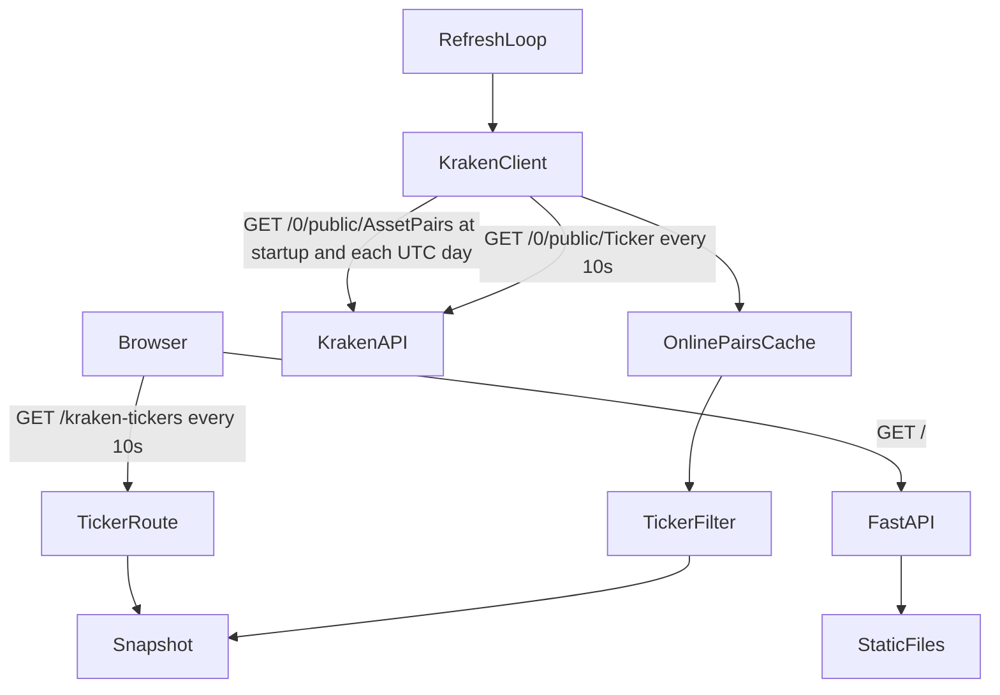

# Architecture

Kraken Spot Radar is a single-process FastAPI application with a static browser
dashboard. It reads public Kraken spot ticker data through `connector-kraken`;
it does not use private credentials or a database.

## Data flow



At startup, the FastAPI lifespan creates one `httpx.AsyncClient` and starts a
  background refresh loop. The app fetches USD pairs with `status == "online"`
  from `AssetPairs` at startup and again when the UTC date changes, then caches
  that list in memory. Every ten seconds, it fetches USD spot tickers and keeps
  only pairs in the online-pair cache before replacing the ticker snapshot. Pair
  names are normalized so the ticker form `XBT/USD` matches the `AssetPairs`
  alternate name `XBTUSD`. If fetching `AssetPairs` fails, the previous ticker
  snapshot remains intact and the app retries on its next refresh. The dashboard
  polls the local ticker route at the same interval. When no snapshot has been
  loaded yet, that route attempts an immediate refresh.

## Modules

- `main.py` owns the FastAPI app, lifecycle, HTTP client, refresh loop, cache,
  routes, and mapping from connector metrics to the ticker response.
- `connector-kraken` fetches and validates public USD spot ticker data.
- `static/index.html`, `static/styles.css`, and `static/app.js` render the
  dashboard, rank movers, and display connection and freshness state.
- `tests/` verifies route behavior using a mocked connector.

## Market data contract

For each USD pair returned by the connector, `openPrice` comes from `open` and
`currentPrice` from `close_price`. `oc` is the percentage change from the
24-hour open, rounded to two decimal places:

```text
oc = round((currentPrice - openPrice) / openPrice * 100, 2)
```

Pairs with a non-positive open or negative last price are excluded. The
`symbol` is the connector's normalized pair name, such as `XBT/USD`.

## Cache and failures

The snapshot and its `updatedAt` timestamp live in process memory. A failed
refresh is logged and leaves the last successful snapshot intact; clients can
use `updatedAt` to tell whether that snapshot is old. If the first refresh
fails, `GET /kraken-tickers` returns an upstream error. `/health` reports
application health and the last successful refresh time; it does not probe
Kraken.

Run one application worker when using the in-memory cache. Multiple workers
would each maintain a separate snapshot and issue their own refresh requests.